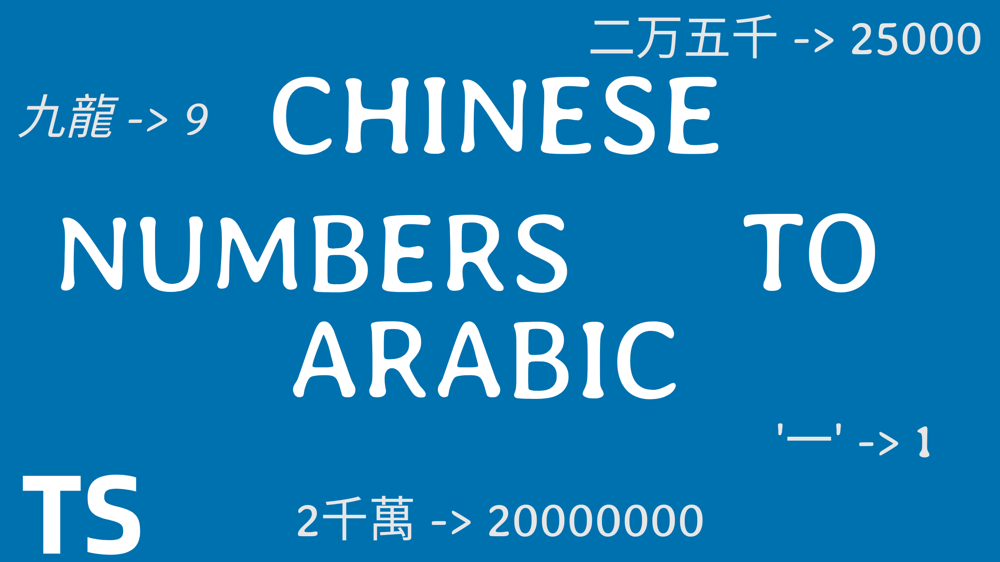
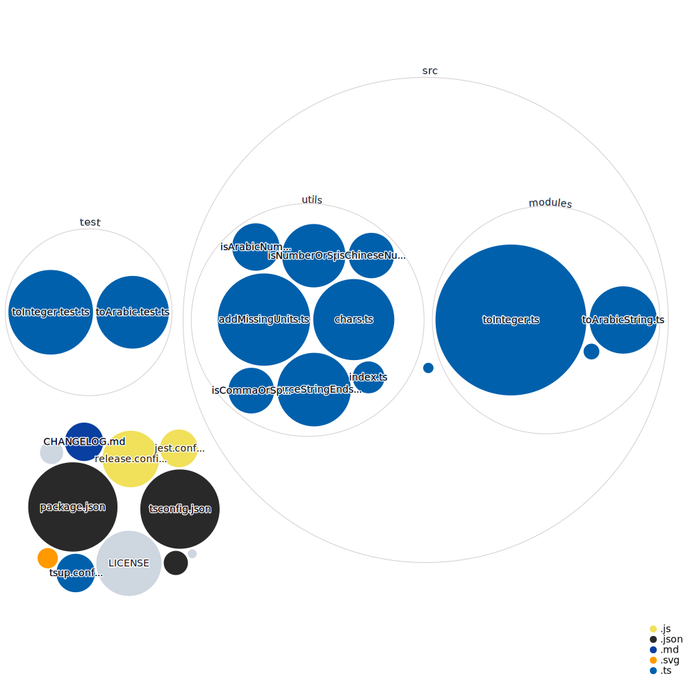

# Chinese Numbers To Arabic



Convert Chinese Numbers to their Arabic Counterpart.


## Install

Yarn

```shell
yarn add chinese-numbers-to-arabic
```

NPM

```shell
npm install chinese-numbers-to-arabic
```

PNPM

```shell
pnpm install chinese-numbers-to-arabic
```

## Language support

Supports Traditional, Simplified, Financial numbers and some dialects. Only integers are supported, except the limited support for Arabic decimal + Chinese number, like "3.5 萬". The largest supported character is 億/亿.

## Usage examples

### To Integer

```ts
import { toInteger } from "chinese-numbers-to-arabic";

toInteger("兩百四十五"); // 245 - Normal number
toInteger("345 萬"); // 3,450,000 - Mixed Arabic and Chinese
toInteger("3.5萬"); // 35,000 - The only supported type of decimals
toInteger("卅六"); // 36 - Cantonese slang
toInteger("***貳佰零伍元***"); // 205 - finance numbers
toInteger("1000 and one"); // 1000 - ignore non-Chinese words
toInteger("345 abc"); // 354 - ignore non-Chinese words
```

### To Arabic String

```ts
import { toArabicString } from "chinese-numbers-to-arabic";

toArabicString("***貳佰零伍元***"); // "***205元***"
toArabicString("354 abc"); // "345 ABC"
toArabicString("3, 5 and 4"); // "3, 5 and 4"
toArabicString("一百. What a great number."); // 100. What a great number.
toArabicString("4 000 000 RMB"); // 4000000 RMB
toArabicString("這款車的價格從34.5萬港幣到55.4萬港幣。"); // 這款車的價格從345000港幣到554000港幣。
```

### Check whether a number is Chinese or not

```ts
import { isChineseNumber } from "chinese-numbers-to-arabic";

isChineseNumber("abcd"); // false
isChineseNumber("兩百四十五"); // true
```

### Check whether a number is Arabic or not

```ts
import { isArabicNumber } from "chinese-numbers-to-arabic";

isArabicNumber("123123123"); // true
isArabicNumber("兩百四十五"); // false
```

### Add missing units - Converts a string like 8 千 3 萬 into 8 千 3 百萬 (8300\*10000).

```ts
import { addMissingUnits } from "chinese-numbers-to-arabic";

addMissingUnits("8千3萬"); // 8千3百萬
```

### Visualization of this Repo.



# Uighur

Although this library is doing work related to Chinese language but it totally disagrees with Barbaric chinese way on genociding the Ethnic Uighur Community. Winnie the Pooh should start being a human again.
